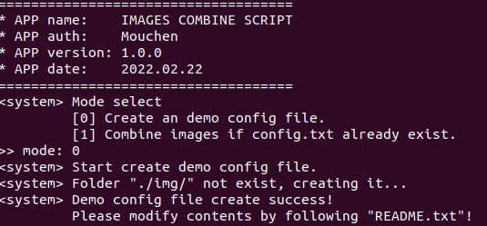
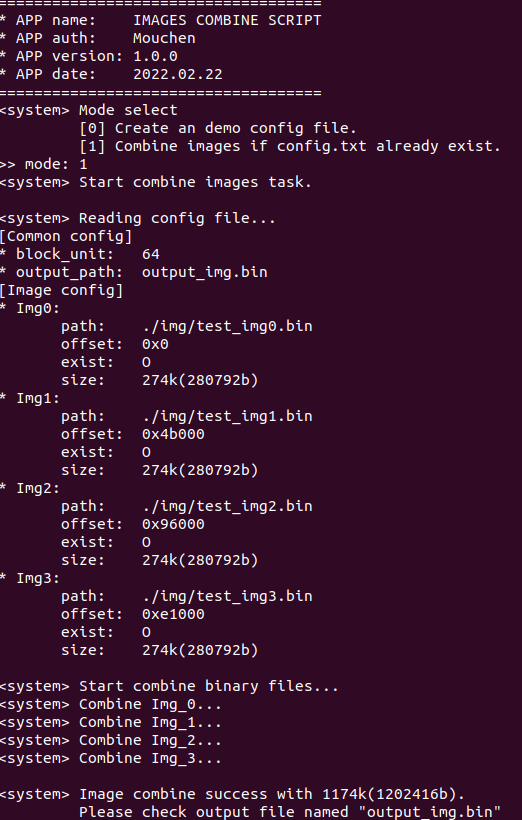

# PROJ_Q_GP_Image_Combine
Combine 4 image to 1 images by following config file.

### Purpose:
    Script to combine 4 images to 1 image in project GP. Output image format as bellow:
      - [Byte04:01(msb)]  Numbers of image
      - [Byte08:05(msb)]  Image1 offset
      - [Byte12:09(msb)]  Image1 size
      - [Byte16:13(msb)]  Image2 offset
      - [Byte20:17(msb)]  Image2 size
      - [Byte24:21(msb)]  Image3 offset
      - [Byte28:25(msb)]  Image3 size
      - [Byte32:29(msb)]  Image4 offset
      - [Byte36:33(msb)]  Image4 size
      - [ IMAGE 1 area ]  IMAGE1 data
      - [ padding area ]  Fill with 0xFF base on given offset mode
      - [ IMAGE 2 area ]  IMAGE2 data
      - [ padding area ]  Fill with 0xFF base on given offset mode
      - [ IMAGE 3 area ]  IMAGE3 data
      - [ padding area ]  Fill with 0xFF base on given offset mode
      - [ IMAGE 4 area ]  IMAGE4 data
      - [ padding area ]  Fill with 0xFF to meet "block_unit" in config file
      - [   MD5 area   ]  16 bytes of MD5 if "encryption" in config file is "enable"

### First rlease date:
    2022.02.22

### Version:
- 1.1.1 - 2022/11/03
  - Feature:
    - Add automatic-offset mode by input mode 2. Still need config.txt but generating offset automaitcally.
      - [image1]
      - [padding] 16 bytes of 0xFF
      - [image2]
      - [padding] 16 bytes of 0xFF
      - [image3]
      - [padding] 16 bytes of 0xFF
      - [image4]
    - Add release package which started from v1.1.1
  - Bug: none
- 1.1.0 - 2022/10/26
  - Feature:
    - Add header to output image with 36bytes
      - [Byte04:01(msb)]  Numbers of image
      - [Byte08:05(msb)]  Image1 offset
      - [Byte12:09(msb)]  Image1 size
      - [Byte16:13(msb)]  Image2 offset
      - [Byte20:17(msb)]  Image2 size
      - [Byte24:21(msb)]  Image3 offset
      - [Byte28:25(msb)]  Image3 size
      - [Byte32:29(msb)]  Image4 offset
      - [Byte36:33(msb)]  Image4 size
    - Add MD5 as last 16 bytes
      - [ByteN-16:N(msb)] 16bytes of MD5
  - Bug: none
- 1.0.0 - First commit - 2022/02/22
  - Feature: none
  - Bug: none

### Required:
- OS
  - Linux: support
  - Windows: support
- Enviroment
  - python(version requirement not sure yet!)

  Note: Given path should include "./img/"!

### Usage
  - **STEP1. Create a demo config file**\
           --> python img_comb.py --> choose mode[0]\
           
           
  - **STEP2. Modify config file**
    - block_unit: Output image's block unit for last image padding, using k(1024b) as base
    - output_path: Final combine-image path
    - encryption: MD5 16bytes adding or not("enable" to active)
    - name: One image name(should not modify!)
    - path: One image path
    - offset: One image start offset(This might cause some problem if set in wrong address)

  - **STEP3. Run**\
           --> python img_comb.py --> choose mode[1] to use cfg-offset mode\
           
           --> python img_comb.py --> choose mode[2] to use auto-offset mode\
           

### Note
- 1: Please choose mode[0] to create folder ***./img*** and demo config file ***config.txt*** if first using this APP.
- 2: Only need to modify ***config.txt*** and choose mode[1] after finished mode[0].
- 3: Images in ***./img*** folder is just demo, please add your own images into it.
- 4: Images must only put in ***./img*** folder.
